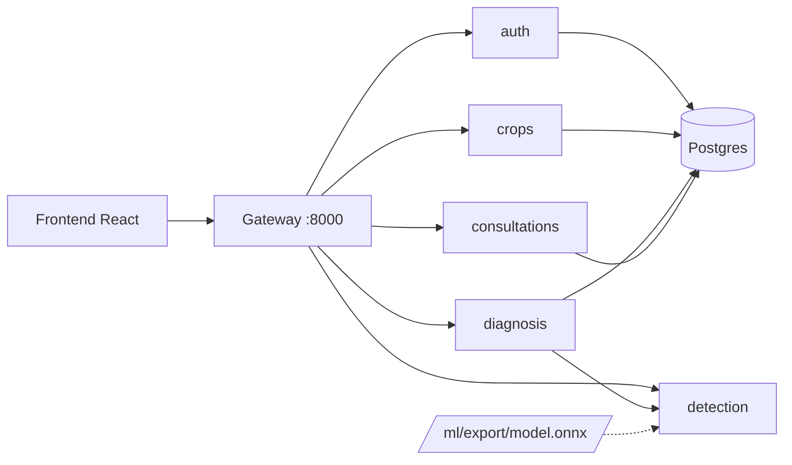

# AgroDoc - Plataforma de Diagnóstico Agrícola

AgroDoc es un ecosistema digital para el monitoreo agrícola y el diagnóstico temprano de plagas mediante Inteligencia Artificial. El usuario sube una foto de su cultivo, el sistema detecta la plaga y entrega un diagnóstico básico; si la confianza del modelo es baja, el caso se envía a un agrónomo para que lo revise. Además permite guardar y dar seguimiento a los cultivos.

Este repositorio es un **monorepo** con arquitectura de **microservicios**: un frontend en React y varios servicios independientes en FastAPI, orquestados con Docker Compose.

> **Estado actual:** la estructura, el entorno Docker y la base de datos están listos. Cada servicio expone por ahora solo un endpoint `/health`; la lógica de negocio se irá agregando servicio por servicio.

## 👥 Equipo y roles

* **Frontend:** Diego Galvez
* **Backend:** Hogla Calix y María Fernanda Rodríguez
* **Entrenamiento IA / Docker:** Alejandro Villanueva

## 🏗 Arquitectura



El frontend solo habla con el **gateway**; los demás servicios se comunican entre sí por la red interna de Docker (por ejemplo `http://auth:8000`).

### Servicios

| Servicio | Responsabilidad | Base de datos | Puerto en dev |
|---|---|---|---|
| `gateway` | Punto de entrada único: enruta las peticiones y valida el token | — | 8000 |
| `auth` | Usuarios, login y roles (agricultor / agrónomo) | `auth_db` | 8001 |
| `crops` | Cultivos guardados por el usuario y su historial | `crops_db` | 8002 |
| `detection` | Inferencia del modelo: imagen → plaga + nivel de confianza | — (carga el modelo desde `ml/export/`) | 8003 |
| `diagnosis` | Convierte la plaga detectada en diagnóstico y recomendaciones | `diagnosis_db` | 8004 |
| `consultations` | Casos enviados a agrónomos cuando la confianza es baja | `consultations_db` | 8005 |
| `web` | Frontend (build de producción servido con nginx) | — | 3000 |
| `postgres` | Un solo servidor con una base de datos por servicio | — | no se publica |

Regla importante: **cada servicio es dueño de su base de datos**. Ningún servicio consulta directamente las tablas de otro; si necesita un dato (por ejemplo el `user_id`), lo pide por API.

## 📁 Estructura del repositorio

```
AgroDoc/
├── Backend/
│   ├── common/              # Código compartido entre servicios (mantenerlo mínimo)
│   └── services/
│       ├── gateway/
│       ├── auth/
│       ├── crops/
│       ├── detection/
│       ├── diagnosis/
│       └── consultations/
├── Frontend/                # React + Vite (JavaScript), gestionado con pnpm
├── ml/                      # Entrenamiento del modelo (no se despliega)
│   ├── notebooks/           # Exploración y experimentos
│   ├── training/            # Scripts de entrenamiento / fine-tuning
│   ├── export/              # Modelo exportado (ONNX) que usa `detection`
│   └── datasets/            # Datos (NO se suben a git)
├── infra/
│   ├── docker-compose.yml       # Definición base de todos los servicios
│   ├── docker-compose.dev.yml   # Override de desarrollo (recarga en caliente, puertos abiertos)
│   ├── postgres/                # Script que crea las bases de datos al iniciar
│   └── nginx/                   # Reservada para configuración de nginx
├── docs/                    # Documentación adicional
├── scripts/                 # Scripts bash para el día a día (ver abajo)
├── .env.example             # Plantilla de variables de entorno
└── README.md
```

### Estructura interna de cada servicio

Todos los servicios de FastAPI tienen el mismo esquema, para que cualquiera pueda moverse entre ellos:

```
Backend/services/<servicio>/
├── app/
│   ├── main.py          # Punto de entrada de FastAPI (incluye /health)
│   ├── api/routes/      # Endpoints
│   ├── core/            # Configuración y seguridad
│   ├── db/              # Sesión y modelos de base de datos
│   ├── schemas/         # Esquemas Pydantic (entrada/salida)
│   ├── services/        # Lógica de negocio
│   └── clients/         # Llamadas HTTP a otros servicios
├── alembic/             # Migraciones (reservada, falta configurarla)
├── tests/
├── requirements.txt
└── Dockerfile
```

## ✅ Requisitos

* [Docker](https://docs.docker.com/engine/install/) con Docker Compose v2 (`docker compose`)
* Git
* `curl` (lo usa `scripts/status.sh`)
* Opcional, para trabajar fuera de Docker:
  * Node.js 22+ y pnpm (`corepack enable`) para el frontend
  * Python 3.12 para los servicios

## 🚀 Inicio rápido

```bash
git clone https://github.com/maferodri/AgroDoc.git
cd AgroDoc
chmod +x scripts/*.sh      # solo la primera vez
./scripts/dev.sh           # construye y levanta todo
./scripts/status.sh        # comprueba que todo responda
```

Si todo está bien, verás un ✔ por cada servicio y podrás abrir:

* Web: http://localhost:3000
* Gateway: http://localhost:8000/health
* Documentación automática de cada servicio (Swagger): `http://localhost:800X/docs` (por ejemplo http://localhost:8001/docs para `auth`)

La primera vez tarda unos minutos porque descarga imágenes y construye cada servicio. El script crea el archivo `.env` automáticamente a partir de `.env.example` si no existe.

## 🛠 Scripts

Todos se ejecutan desde cualquier carpeta del repo, por ejemplo `./scripts/dev.sh`.

| Script | Qué hace |
|---|---|
| `scripts/dev.sh [servicio...]` | Levanta el entorno de desarrollo. Sin argumentos levanta todo. |
| `scripts/down.sh` | Apaga y elimina los contenedores (los datos de Postgres se conservan). |
| `scripts/status.sh` | Lista los contenedores y comprueba el `/health` de cada servicio. |
| `scripts/logs.sh [servicio]` | Sigue los logs en vivo. Ejemplo: `./scripts/logs.sh auth`. |
| `scripts/rebuild.sh <servicio>` | Reconstruye un servicio. Úsalo si cambias `requirements.txt`, `package.json` o un Dockerfile. |
| `scripts/reset-db.sh` | **Borra** los datos de Postgres y recrea las bases desde cero (pide confirmación). |

## 💻 Flujo de trabajo por rol

### Backend (FastAPI)

En desarrollo, el código de cada servicio está montado dentro del contenedor y uvicorn corre con `--reload`: al guardar un archivo en `Backend/services/<servicio>/app/`, el servicio se recarga solo.

* **Agregar una dependencia:** añádela a `requirements.txt` del servicio y ejecuta `./scripts/rebuild.sh <servicio>`.
* **Ver errores:** `./scripts/logs.sh <servicio>`.
* **Probar un servicio directo:** cada uno tiene su puerto (tabla de servicios) y su Swagger en `/docs`.
* **Variables de entorno:** cada servicio recibe `DATABASE_URL` (y las URLs de otros servicios) desde `infra/docker-compose.yml`. Si necesitas una nueva, agrégala ahí.
* **Entrar a la base de datos:**

  ```bash
  docker compose -f infra/docker-compose.yml --env-file .env exec postgres psql -U agrodoc -d crops_db
  ```

  (cambia `crops_db` por la base que necesites; el usuario es el valor de `POSTGRES_USER` en tu `.env`).
* **Trabajar sin Docker (opcional):**

  ```bash
  cd Backend/services/crops
  python -m venv .venv && source .venv/bin/activate
  pip install -r requirements.txt
  uvicorn app.main:app --reload --port 8002
  ```

### Frontend (React)

El contenedor `web` sirve el build de producción, sin recarga en caliente. Para desarrollar conviene correr Vite en local:

```bash
cd Frontend
corepack enable          # una sola vez, activa pnpm
pnpm install
pnpm dev                 # http://localhost:5173
```

Otros comandos: `pnpm build` (compilar) y `pnpm lint` (oxlint).

La API se consume a través del **gateway** (`http://localhost:8000`). Cuando el gateway tenga rutas, habrá que habilitar CORS para `http://localhost:5173`.

> Este proyecto usa **pnpm**. No uses `npm install` ni `yarn`: generan otro lockfile y rompen el build de Docker (`--frozen-lockfile`).

### IA / Modelo

* El entrenamiento y los experimentos viven en `ml/` y **no** forman parte de las imágenes de Docker.
* El servicio `detection` carga el modelo desde `ml/export/model.onnx` (montado como volumen en `/models`, variable `MODEL_PATH`). Para probar un modelo nuevo basta con reemplazar ese archivo y reiniciar el servicio: `./scripts/rebuild.sh detection`.
* Los datasets (`ml/datasets/`) y los modelos (`*.onnx`, `*.pt`) están en el `.gitignore` y **no se suben al repositorio**. Hay que compartirlos por otro medio (Drive, release, etc.).

## 🗄 Base de datos

Hay un único servidor Postgres con una base por servicio: `auth_db`, `crops_db`, `diagnosis_db` y `consultations_db`. Se crean con `infra/postgres/init-databases.sh`.

* Ese script **solo corre cuando el volumen está vacío** (la primera vez). Si lo modificas o agregas una base nueva, ejecuta `./scripts/reset-db.sh` (borra los datos) o créala a mano.
* Postgres no se publica en tu máquina; solo los servicios lo ven por la red interna.
* Los datos se guardan en el volumen `agrodoc_pgdata`, así que sobreviven a `./scripts/down.sh`.

## ➕ Agregar un servicio nuevo

1. Copia la estructura de otro servicio en `Backend/services/<nuevo>/` (con su `Dockerfile` y `requirements.txt`).
2. Añádelo a `infra/docker-compose.yml` y a `infra/docker-compose.dev.yml` (con un puerto libre).
3. Si necesita base de datos, agrégala a la lista de `infra/postgres/init-databases.sh` y a su `DATABASE_URL`.
4. Registra su URL en las variables del `gateway`.
5. Actualiza `SERVICES` en `scripts/_common.sh` y el mapa de puertos de `scripts/status.sh`.

## 📏 Convenciones

* **Frontend:** React con JavaScript, linter **oxlint**, gestor **pnpm** (versión fijada en `packageManager`).
* **Backend:** una carpeta por servicio con la estructura de arriba; sin acceso cruzado entre bases de datos.
* **Secretos:** nunca subas `.env`. Las plantillas van en `.env.example`.
* **Dependencias:** nunca commitees `node_modules`, `.venv`, datasets ni modelos.
* **Git:** se recomienda trabajar en ramas por funcionalidad (`feature/<area>-<descripcion>`) y hacer pull request hacia `main`, en lugar de commitear directo.

## 🩹 Problemas comunes

* **El puerto ya está en uso:** algo más usa 3000 u 8000-8005. Detenlo o cambia el puerto en `infra/docker-compose.yml`.
* **Un servicio no responde:** `./scripts/logs.sh <servicio>` muestra el error. Si cambiaste dependencias, usa `./scripts/rebuild.sh <servicio>`.
* **Cambié `.env` y no se aplica:** reinicia con `./scripts/down.sh` y luego `./scripts/dev.sh`.
* **`Permission denied` en los volúmenes (Fedora/SELinux):** agrega `:z` al final de los volúmenes montados en `infra/docker-compose.dev.yml` (por ejemplo `"../Backend/services/auth:/code:z"`).
* **Quiero empezar de cero:** `./scripts/down.sh`, y si también quieres borrar los datos, `./scripts/reset-db.sh`.

## 🗺 Próximos pasos

- [ ] Gateway: enrutado hacia los servicios y validación de token
- [ ] `auth`: registro, login (JWT) y roles
- [ ] Configurar Alembic y crear los modelos de cada servicio
- [ ] `crops`: CRUD de cultivos e historial
- [ ] `detection`: carga del modelo ONNX y endpoint de inferencia
- [ ] `diagnosis` y `consultations`: flujo de baja confianza hacia agrónomos
- [ ] CORS para el frontend en desarrollo
- [ ] Linter y formateador para Python (por ejemplo Ruff)
